#  Treemapolis

**Your disks, as a city you can fly through.** Treemapolis turns the Windows shell namespace into a 3D treemap: every folder is a
slab, every file a building as big as it weighs on disk. It is a technology demo of DirectX 12 driven from C# and .NET NativeAOT,
and it is also a genuinely fast disk space explorer.

It is an evolution of [Filociraptor](https://github.com/smourier/Filociraptor), a fast Windows file manager in pure C#, DirectX and
NativeAOT. The same approach and the same libraries, taken from a flat list of files to a whole machine in three dimensions.

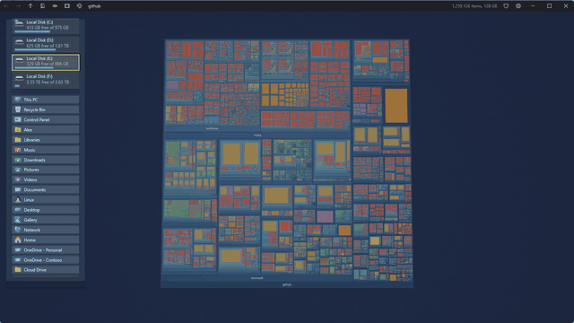

🎬 **[Watch the demo video](https://github.com/smourier/Treemapolis/raw/main/media/treemapolis-demo.mp4)** (2:08, everything below, in real time)

## At a glance

* **Windows only.** DirectX 12, DirectComposition, the Windows shell and NTFS are the whole point, there is no cross platform version, we stick to the metal.
* **x64 and ARM64**, compiled ahead of time with .NET NativeAOT. **No runtime to install, one self contained executable about 3 MB** once compressed with UPX
  (x64, UPX cannot pack ARM64 images, so that one ships at its full size).
* **100 % C#, plus HLSL shaders.** We don't need no C, C++, Rust, Zig or any other native code of our own, and no native DLL beside the exe.
  We do have HLSL shaders because that is what a GPU runs, compiled at build time. The language is not the point, the technology is:
  a GPU driven renderer, compute shaders, indirect drawing and direct NTFS access, all reached from C#.
* **A demo that works.** When run as administrator, NTFS drives are read straight from their master file table: a whole C: drive of
  2.8 million items (3.3 million records) is on screen in about 6 seconds. Without elevation, folders are walked on several threads.

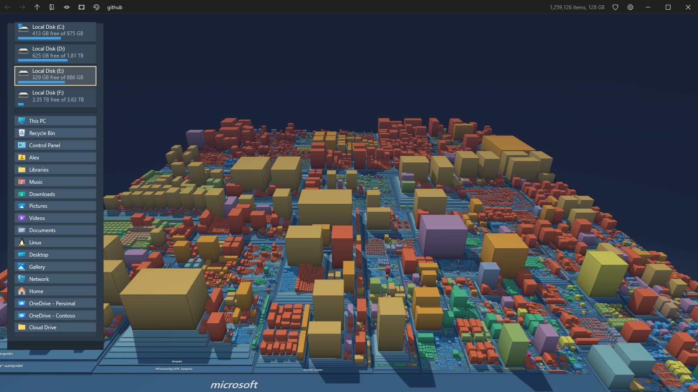

## What it does

### See where the space went

* **The whole shell namespace**, not only file systems: This PC, drives, libraries, the Desktop, network locations, and any folder the
  shell knows about.
* **Every local drive at once.** This PC scans all of them in the background, the Windows drive first, so the whole machine fills in
  while you look. Mapped network drives and shares are left out, a server can be slow or gone. A setting turns the scan off.
* **Squarified 3D treemap.** Folders are slabs stacked by depth, files are blocks sized by what they take on disk. Small items are
  gathered into one block so the map stays readable.
* **Master file table reading** on NTFS when elevated. A shield button in the caption, or F2, restarts elevated in the same place with
  the same camera. A loading panel shows the progress while a drive is read.

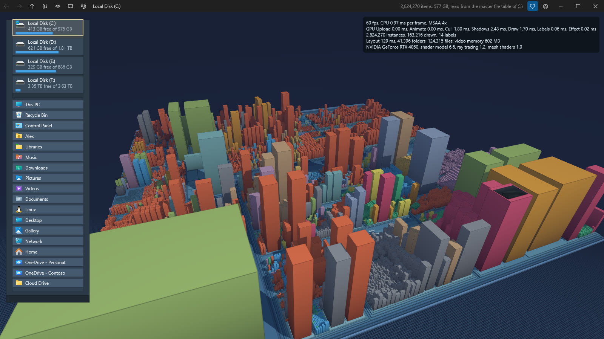

* **Colors by file type or by age**, with a legend. Hidden and system items are darker, and can be hidden altogether.
* **Building height slider**, from a flat classic treemap up to a skyline ten times taller, the tallest by default.

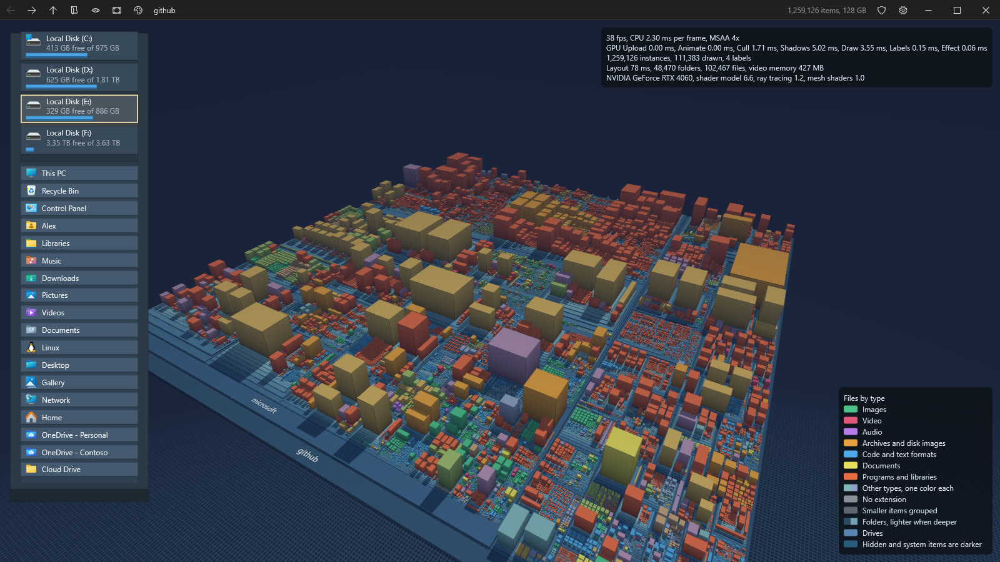

### Move around

* **Orbit, pan and zoom** with the mouse, the camera flies smoothly from one place to the next.
* **Dive into any folder** with a double click, back, forward and up like a browser, with the history kept across folders.
* **A path you can click.** The caption shows where you are, folder by folder. A name takes you there, the chevron after it lists
  the folders it holds, largest first with their size, and typing filters the list.
* **Jump anywhere** with Ctrl+K: type part of a name and every folder of every scanned drive is searched as you type, best matches
  and biggest folders first. Type a path instead (`C:\Users`, `\\server\share`, `%APPDATA%`, `shell:Downloads`) to go straight
  there, or pick a folder with the Windows folder picker (Ctrl+O).
* **Folder wheel.** Middle click anywhere for a sunburst of the subfolders around the pointer, each arc as wide as its share of the
  disk. Move outward to grow the next ring, click an arc to fly there.
* **Walk with the arrow keys** from block to block, the camera follows, Enter dives in.
* Whatever you point at in a list or on the wheel lights up on the map before you go.

| The folder wheel | The path and its folders |
|---|---|
| 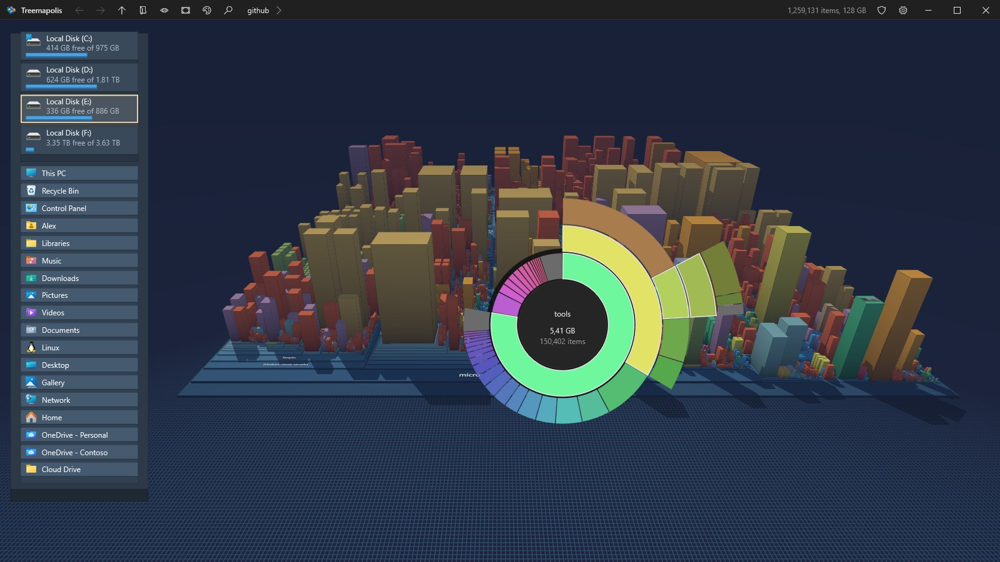 | 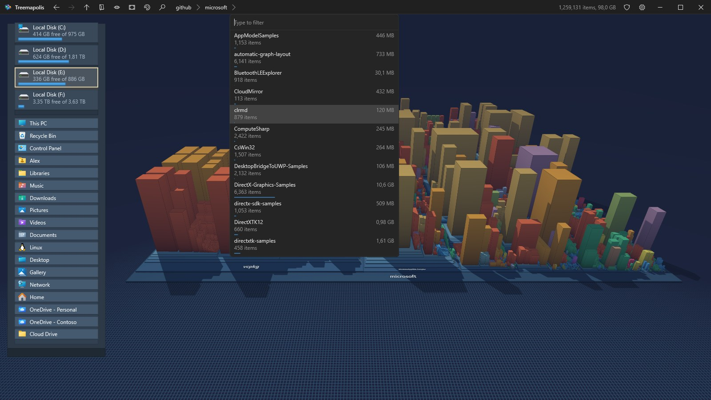 |

* **Street level.** Come down between the buildings and look up at them and at the sky.
* **Drives and places island** on the left, always there: every local drive with its free space, and the children of the Desktop, with their
  shell icons. A click takes you there.
* **Names you can always read.** Folder names lie flat on their slab, and when the camera goes round to the other side they turn half
  a turn within the same band, so they never read upside down or backwards.

| From the front | From behind |
|---|---|
| 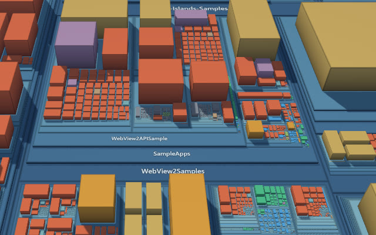 | 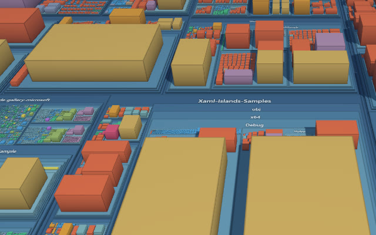 |

* **Hover** any block for its name, size and date, **right click** for its real shell context menu, **reveal it in Explorer**.
* **Recent folders**, `treemapolis <path>` from the command line, and the last place and camera restored at startup.
  `treemapolis /freshsettings` starts from the default settings and leaves the saved ones untouched.

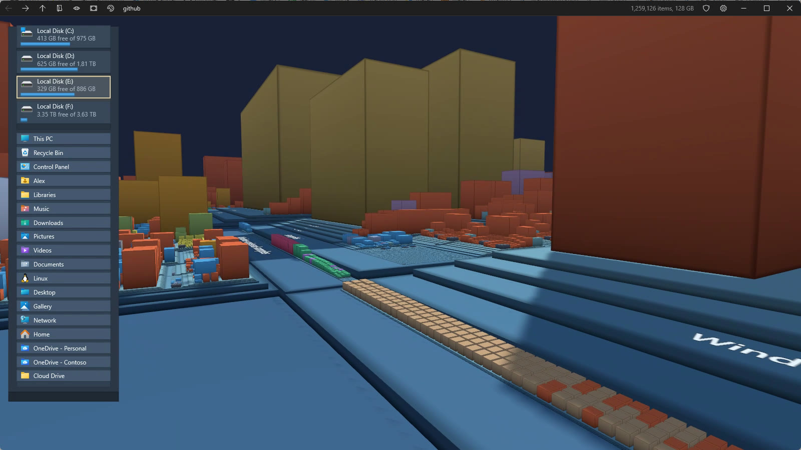

### Pictures on the blocks

* **Shell thumbnails** on the top of every file block close enough to see: photos, videos, documents, fonts, anything with a thumbnail
  handler. They live in a GPU texture array atlas with their own mip levels, and keep their edges clean at any angle.

| | |
|---|---|
| 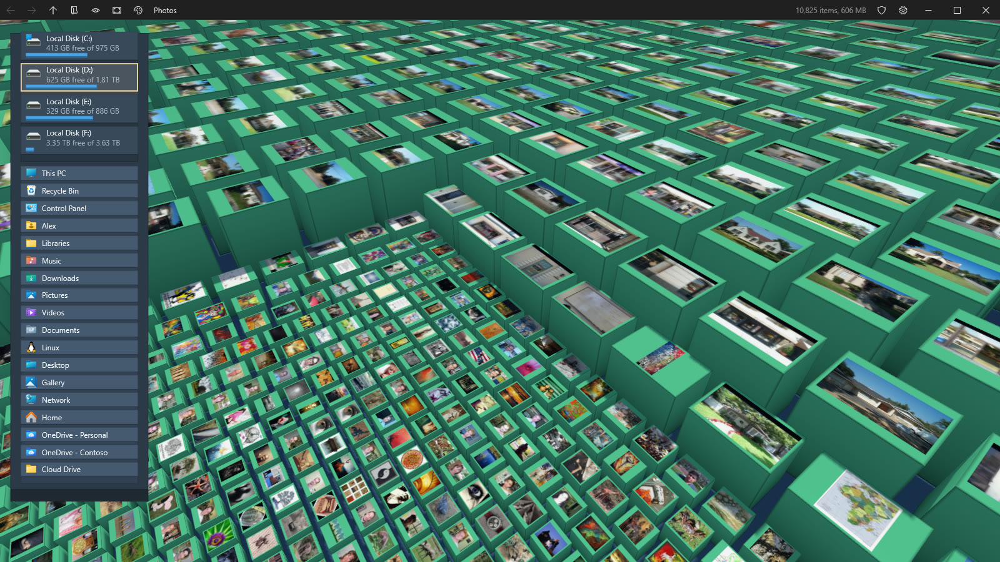 | 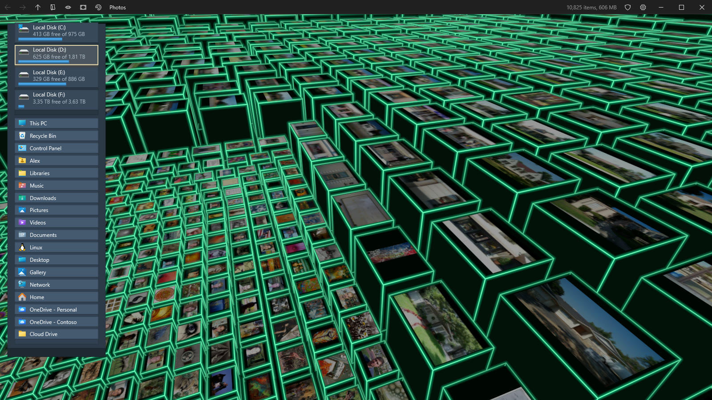 |

### Live

* **The disk is watched.** Files and folders created, grown or deleted while you look flash green, amber or red, files jump up and
  settle, removed items sink away. Drives plugged in or removed update the island and This PC.

### Light, shadows and effects

* **Real time shadows** from a shadow map with its own GPU culling, so a tower out of sight still casts its shadow into the view.
  **Sun direction slider**, and every building side darkens towards its base.
* **Screen effects**, switched live from the settings menu or with E:
  * **Cartoon**, flat color bands and ink outlines.
  * **Pixel art**, big pixels in the PICO-8 palette with ordered dithering.
  * **Neon**, glowing tubes of saturated color along every edge.
  * **New York 2027**, (for the ones who know) green vector lines on black, brightest at the nearest corner and fading into the night.
* **Antialiasing** off, MSAA 2x, 4x or 8x, **vertical sync** on or off, with tearing when off.

| | |
|---|---|
| 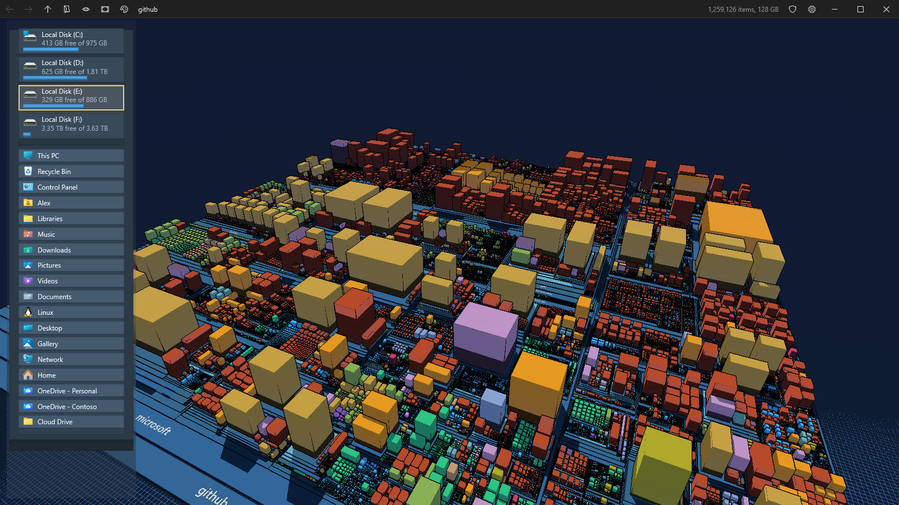 | 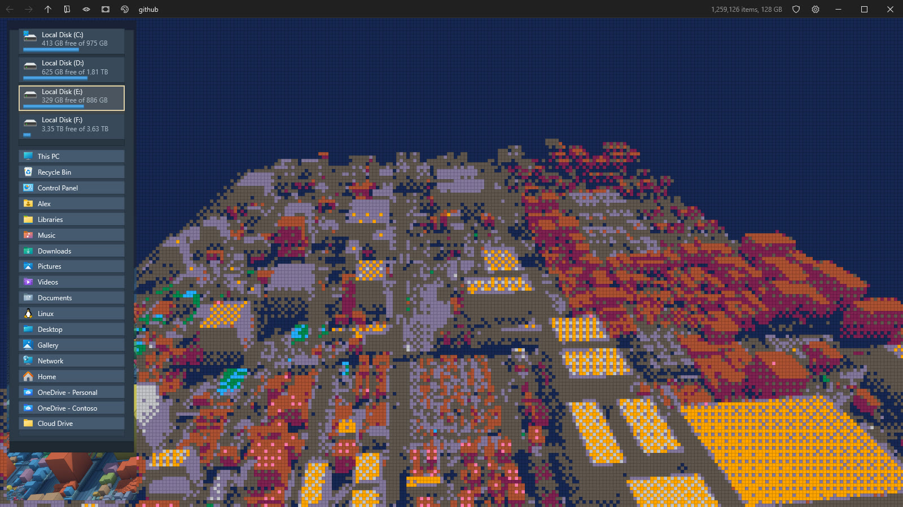 |
| 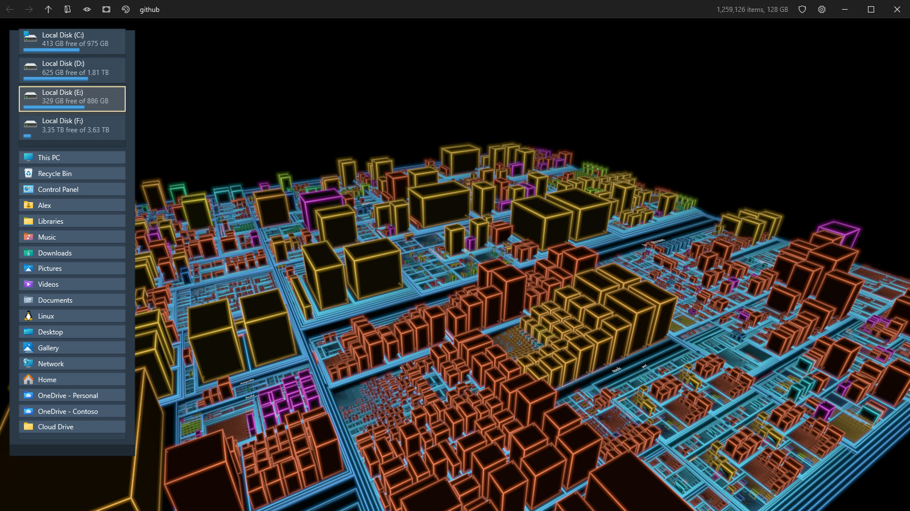 | 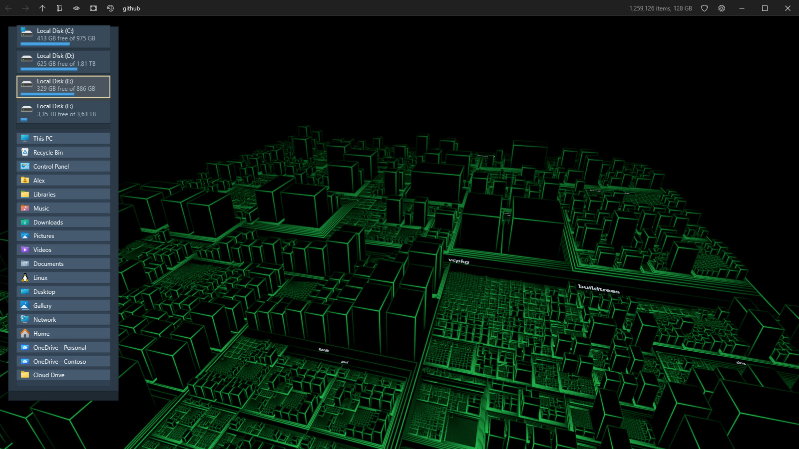 |

### A proper Windows app

* **Dark and light themes** following Windows, **Mica and Acrylic** window materials on Windows 11.
* **Its own caption bar** with the icon, the name and navigation buttons, working snap layouts, per monitor DPI, and borderless **full screen** (Alt+Enter)
  that keeps the caption.
* **Settings menu** with everything above, saved as JSON beside the exe or in `%LOCALAPPDATA%\Treemapolis`.
* **Performance overlay** (F3, off by default) with frames per second, CPU time and GPU time per pass, instance counts, video memory and adapter features.

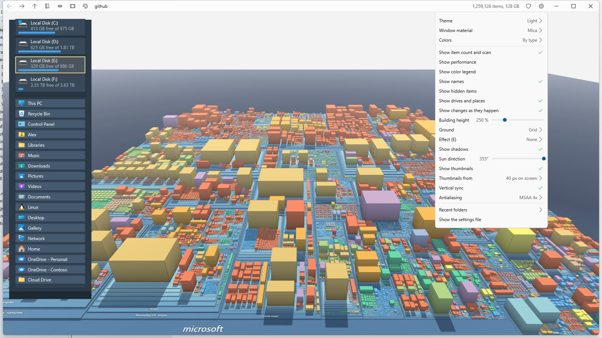

## Keyboard

| Key | Action |
|---|---|
| Ctrl+K, Ctrl+F | Jump to any folder, or type a path |
| Ctrl+O | Pick a folder with the Windows folder picker |
| Arrows | Move the selection to the neighboring block |
| Enter | Dive into the selection, open a file |
| Backspace | Up to the parent folder |
| Alt+Left, Alt+Right | Back, forward |
| Home | Frame the whole map |
| C | Color by type or by age |
| H | Show or hide hidden items |
| E | Next screen effect |
| L | Legend |
| F1 | All panels |
| F3 | Performance overlay |
| F2 | Restart as administrator to read master file tables |
| Alt+Enter, Esc | Full screen, leave full screen |

## Under the hood

* **GPU driven rendering.** The CPU uploads where every entry should be only when the layout changes. Every frame, compute shaders ease
  millions of instances towards their targets, cull them in parallel chunks against the camera, compact the survivors, and a single
  `ExecuteIndirect` draws them all. The sun culls the same way for itself.
* **Reversed depth** with an infinite far plane, so a whole disk of several kilometers fits without z fighting.
* **Two layers.** The 3D scene is a Direct3D 12 swap chain, the caption, panels, menus and texts are Direct2D and DirectWrite on a
  DirectComposition visual above it.
* **Labels** rasterized once into a GPU atlas, **thumbnails** in a bindless texture array, **effects** either as a post pass or as
  anti aliased screen space lines drawn with the scene.
* **.NET NativeAOT**, with interop through the [DirectNAot](https://github.com/smourier/DirectNAot),
  [ShellN](https://github.com/smourier/ShellBat) and [WicNet](https://github.com/smourier/WicNet) NuGet packages. Shaders are
  compiled at build time with DXC, from its NuGet package.

## Requirements

* Windows 10 version 2004 or later, Windows 11 for Mica and Acrylic. Virtual Machines are supported.
* A GPU with Direct3D 12 feature level 12.0. Without one, Treemapolis falls back to WARP, the software renderer that comes with Windows,
  which is slower but draws everything, effects included.
* Administrator rights only to read NTFS master file tables, everything else runs as a normal user.
